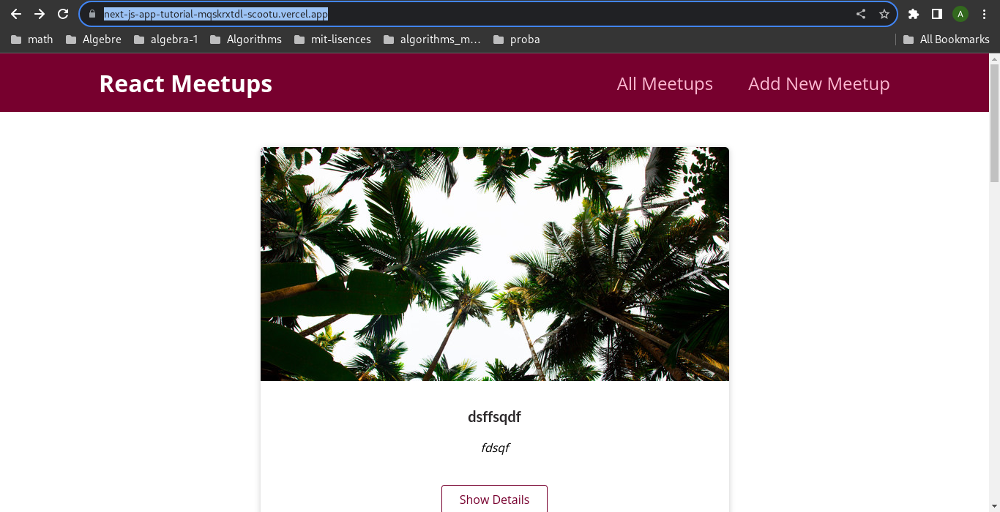

## React - The Complete Guide (incl Hooks, React Router, Redux) 
### expenses-app(s5)
#### code 
- [code](./code/)
#### project
- [code](./project/01-expenses-app(s3-s5))
- [project-demo](https://expenses-app-react.onrender.com/)
### goels-app (s6-s7)
- [project-code](./project/02-goals-app(s6-s7))
- [project-demo](https://goels-app-react.onrender.com/)
### section8-section9 project 
- [code](./03-section8&section9)
- [project-demo](https://section8-secition9pr.onrender.com)
### login-app(s10)
- [code](./04-login-app(s10))
- [project-demo](https://loginapp-react.onrender.com)
### order food app (s11)
- [code](./05-Order-food-app(S11))
- [project-demo](https://orderfood-app-react.onrender.com)
### behind the scence project(s12)
- [code](./06-Behind-the-scense)
- [project-demo](https://behindthescense-react-project.onrender.com)
### Class based component (s13)
- [code](./07-class-based-component)
- [ch1](./07-class-based-component/code/ch1)
- [project-code](./07-class-based-component/project)
- [project-demo](https://class-based-component-react-project.onrender.com)
### Movie project(s14)
- [code](./code/14-http-requestes)
- [project-code](./project/08-movie-app)
- [project-demo](https://movie-seat-project.onrender.com)
### Timer app project (s15)
- [code](./code/15-CustomHooks/01-creating-customHook)
- [demo](https://timer-app-project.onrender.com)
### Task app project with firebase (s15)
- [code](./code/15-CustomHooks/02-more-realistic-project)
- [demo](https://task-app-react.onrender.com)
### Form app (s16)
- [code](./code/16-work-with-forms)
- [project-code](./project/10-formApp)
- [project-demo](https://form-app-react-v0-1.onrender.com)
### Order Food app with form (s17)
- [code](./project/11-orderFood-(optimizatioin))
- [project-demo](https://order-app-form.onrender.com)
### Redux Counter(s18)
- [code](./project/12-redux-app-counter)
- [project-demo](https://redux-counter-b1gw.onrender.com)
### Redux Cart(s19)
- [code](./project/13-Redux-cart)
- [project-demo](https://redux-cart.onrender.com)
- 
### Event New letter(s21-s22) 
- [code](./project/14-Event-new-letter)
- [project-demo]()
- [build-project-article](https://aneshamdaoui.hashnode.dev/creating-an-authentication-token-for-a-react-app-a-simple-guide)
- 
# React meetups event nextjs (s23)
- [code](./code/23-Nextjs/bigger-nextjs-project)
- [project-demo](https://next-js-app-tutorial-mqskrxtdl-scootu.vercel.app/)
- 
# Replacing Redux with React Hooks (S25) 
- [code](./code/25-replace-redux/replace_redux_with_Context_api)
- [project-demo](replace-redux-1ow3tko6o-scootu.vercel.app)
- 
# TypeScript + React (S27) 
- [code](./code/27-React+Typescript/basic-typescript)
- [project-demo](https://typescript-basic-nu.vercel.app/)
- 
